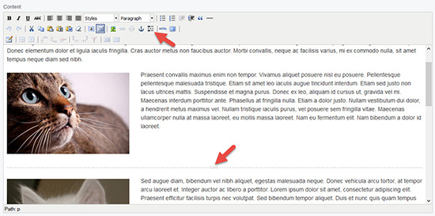
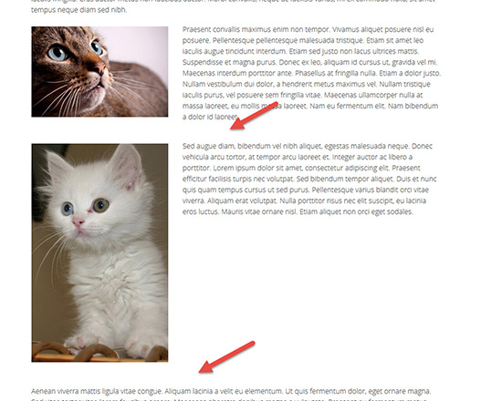

# SilverStripe TinyMCE clear-floats plugin

[](https://packagist.org/packages/innoweb/silverstripe-tinymce-clearfloats)
[](license.md)

This is a SilverStripe port of the [Wordpress plugin](https://github.com/tyrann0us/tinymce-clear-buttons) by [David Bammes](https://github.com/tyrann0us).

## Overview

Adds a clear-floats plugin to the TinyMCE editor in the CMS. 

It uses an image in the editor to visualise the clearing element and replaces it with a `<br style="clear:both;" />` 
for display on the site. 


*CMS view*


*Frontend view*

## Requirements

* SilverStripe CMS ~3.1

## Installation

Install the module using composer:
```
composer require innoweb/silverstripe-tinymce-clearfloats dev-master
```
or download or git clone the module into a ‘tinymce-clearfloats’ directory in your webroot.

Then run dev/build.

## Configuration

To clean up whitespace added when the clearing `<br>` is the only element in a `<p>`, please add the following CSS in your editor.css file:

```
p > br[style="clear: both;"]:only-child:first-child {
	content: ' ';
	display: block;
	margin: 0 0 -1.2em 0;
	overflow: hidden;
}
```

You should adjust the negative margin in the code above to negate the margin set on your `<p>` elements. 

## License

BSD 3-Clause License, see [License](license.md)
